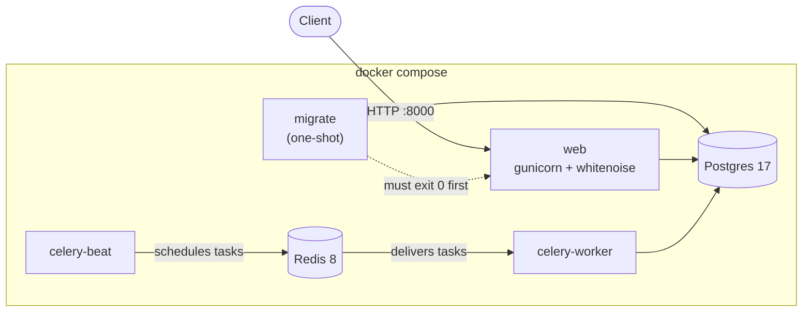
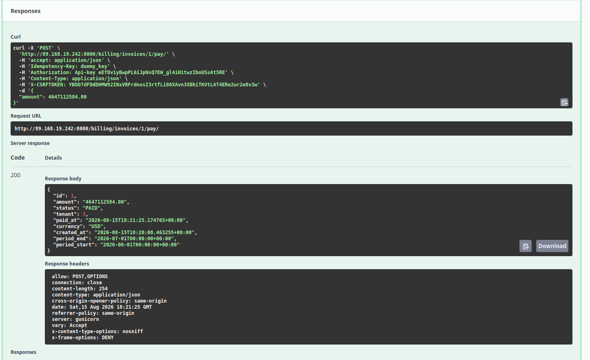
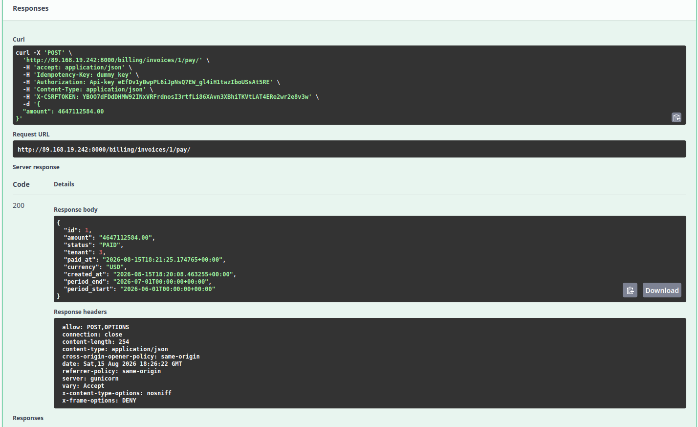

# Multi-Tenant Billing API

A billing API built with Django and DRF. It charges companies on a monthly cycle, keeps each company's data isolated, and **never double-charges** — even when the same payment request arrives twice.

Every movement of money is recorded as a double-entry ledger pair, and payments are made idempotent by a database constraint rather than an application-level check.

**Live:** https://multi-tenant-billing-app.duckdns.org/api/docs/

> [!NOTE]
> The live instance is a demo. API keys are stored in plaintext and the tenant/plan creation endpoints are open. Each is a deliberate simplification, not an oversight.

## Features

- **Idempotent payments.** `POST /pay` requires an `Idempotency-Key`. A repeated request returns the stored response byte-for-byte and writes nothing.
- **Per-tenant isolation.** Every request is scoped by an API key; one tenant can never read or affect another's data.
- **Double-entry ledger.** Every transaction writes two rows that sum to zero and share a `transaction_id`. The ledger is append-only — mistakes are corrected with a reversing pair, never an edit.
- **Scheduled invoicing.** A Celery worker bills every tenant whose billing period has closed, driven by Celery beat.
- **Usage-based pricing.** Plans combine a fixed `base_fee` with a per-unit `unit_fee` carried to eight decimal places.
- **OpenAPI docs.** Swagger UI at `/api/docs/`, raw schema at `/api/schema/`.

## Architecture



`migrate` runs the database migrations and exits. `web` waits on it via `depends_on: condition: service_completed_successfully`, so migrations never race the application, and multiple app containers never run them concurrently.

Business logic lives in `billing/services.py` as plain functions that take a `Tenant` and return values — no `request` object. That is what lets the HTTP endpoint, the Celery task, and the test suite all call the same code.

## Quick start

Requires Docker and Docker Compose.

```bash
git clone git@github.com:SupeeerMario/multi-tenant-billing-system.git
cd multi-tenant-billing-system
cp .env.example .env        # then fill it in — see Configuration
docker compose up -d --build
```

The API is on http://localhost:8000, docs on http://localhost:8000/api/docs/.

```bash
docker compose logs -f web          # follow the access log
docker compose exec web python manage.py test
docker compose down                 # never `down -v` — that deletes the database volume
```

## Configuration

All configuration comes from a `.env` file at the repo root, which Docker Compose reads for `${...}` interpolation. **A fresh clone has no `.env`, and the stack will not start without one.**

| Key | Example | Notes |
| --- | --- | --- |
| `SECRET_KEY` | `a-long-random-string` | No default. Django refuses to start without it. |
| `DEBUG` | `False` | Compared as a string — only the literal `true` (any case) enables it. |
| `ALLOWED_HOSTS` | `localhost,127.0.0.1` | Comma-separated. Must include the public IP or domain in production. |
| `DB_ENGINE` | `django.db.backends.postgresql` | |
| `DB_NAME` | `billing_db` | |
| `DB_USERNAME` | `billing_user` | |
| `DB_PASSWORD` | `changeme` | |
| `DB_PORT` | `5432` | |

`DB_HOST` and `CELERY_BROKER_URL` are set in `docker-compose.yml` directly, because they name services on the Compose network (`db` and `redis`) rather than anything environment-specific.

> [!WARNING]
> Setting `DEBUG=True` in production also re-enables Django's own static file serving, which masks static configuration errors. The deployed instance runs with `DEBUG=False` and serves static assets through whitenoise.

## Authentication

Every tenant-scoped endpoint requires the tenant's API key in the `Authorization` header, **including the `Api-Key` prefix**:

```
Authorization: Api-Key <your-api-key>
```

The key is returned once, in the response to `POST /billing/tenants/`. In Swagger UI's **Authorize** dialog, paste the whole value — prefix included — because the scheme is `apiKey` on `Authorization` and the UI sends what you type verbatim.

The error messages distinguish the two failure modes:

| Response | Meaning |
| --- | --- |
| `Authentication credentials were not provided.` | No header, or the `Api-Key ` prefix is missing |
| `Tenant not found` | Prefix correct, key unknown or tenant inactive |

## API walkthrough

The full flow, in order. `POST /billing/tenants/` and `POST /billing/plans/` are open; everything after needs the key.

**1. Create a tenant** — this is the only time the API key is shown.

```bash
curl -X POST http://localhost:8000/billing/tenants/ \
  -H 'Content-Type: application/json' \
  -d '{"name": "Acme"}'
```

**2. Create a plan.**

```bash
curl -X POST http://localhost:8000/billing/plans/ \
  -H 'Content-Type: application/json' \
  -d '{"name": "Standard", "base_fee": "20.00", "unit_fee": "0.10000000",
       "currency": "USD", "interval": "MONTHLY"}'
```

**3. Subscribe the tenant to the plan.** You supply `current_period_start`; the server derives `current_period_end` as one month later.

```bash
curl -X POST http://localhost:8000/billing/subscriptions/ \
  -H 'Authorization: Api-Key <key>' -H 'Content-Type: application/json' \
  -d '{"plan": 1, "current_period_start": "2026-06-01T00:00:00Z"}'
```

**4. Record usage.** `occurred_at` must fall inside the billing window to be charged.

```bash
curl -X POST http://localhost:8000/billing/usage/ \
  -H 'Authorization: Api-Key <key>' -H 'Content-Type: application/json' \
  -d '{"metric": "api_calls", "quantity": 100, "occurred_at": "2026-06-15T00:00:00Z"}'
```

**5. Generate the invoice.** No request body — the window comes from the subscription.

```bash
curl -X POST http://localhost:8000/billing/invoices/generate/ \
  -H 'Authorization: Api-Key <key>'
```

> [!IMPORTANT]
> A billing period that has not ended cannot be invoiced. Billing `Aug 1 → Sep 1` on August 15th would permanently orphan every usage event recorded for the rest of the month, so the service refuses with `PeriodNotEnded`.

**6. Pay it.** See below.

### Endpoints

| Method | Path | Auth | Purpose |
| --- | --- | --- | --- |
| `POST` | `/billing/tenants/` | open | Create a tenant, returns its API key |
| `POST` | `/billing/plans/` | open | Create a plan |
| `POST` | `/billing/subscriptions/` | key | Subscribe the tenant to a plan |
| `GET` `POST` | `/billing/usage/` | key | List or record usage events |
| `POST` | `/billing/invoices/generate/` | key | Invoice the closed billing period |
| `POST` | `/billing/invoices/<id>/pay/` | key | Pay an invoice (idempotent) |

## The no-double-charge proof

This is the point of the project. The same payment request is sent twice with the same `Idempotency-Key`; the customer is charged once.

**Both requests, identical:**

```bash
curl -X POST 'https://multi-tenant-billing-app.duckdns.org/billing/invoices/1/pay/' \
  -H 'Idempotency-Key: dummy_key' \
  -H 'Authorization: Api-Key <key>' \
  -H 'Content-Type: application/json' \
  -d '{"amount": 4647112584.00}'
```

**Both responses, byte-identical:**

```json
{
  "id": 1,
  "amount": "4647112584.00",
  "status": "PAID",
  "tenant": 3,
  "paid_at": "2026-08-15T18:21:25.174765+00:00",
  "currency": "USD",
  "created_at": "2026-08-15T18:20:08.463255+00:00",
  "period_end": "2026-07-01T00:00:00+00:00",
  "period_start": "2026-06-01T00:00:00+00:00"
}
```

The two responses carry **different `date` headers** — `18:21:25` and `18:26:22` — so the second request genuinely reached the server five minutes later. It returned the first request's `paid_at`, because that response was stored and replayed rather than recomputed.

Both requests, run against the live instance through Swagger UI:

**First request — the payment actually happens.**



**Second request, same key five minutes later — the stored response is replayed.**



**The ledger, which is what proves only one charge occurred:**

```
 id |       account       |     amount     |            transaction_id            | invoice_id
----+---------------------+----------------+--------------------------------------+------------
  1 | ACCOUNTS_RECEIVABLE |  4647112584.00 | 3f376041-3c0f-4e88-ab6c-5db7c76f6c34 |          1
  2 | REVENUE             | -4647112584.00 | 3f376041-3c0f-4e88-ab6c-5db7c76f6c34 |          1
  3 | ACCOUNTS_RECEIVABLE | -4647112584.00 | 1813cadb-dad2-4332-8d95-60345c5047b6 |          1
  4 | CASH                |  4647112584.00 | 1813cadb-dad2-4332-8d95-60345c5047b6 |          1
```

Rows 1–2 are the invoice: you earned it, you are owed it. Rows 3–4 are the payment: the money moves from owed to held. **One payment pair, not two.** Each pair shares a single `transaction_id`.

**One idempotency key, not two:**

```
 id |    key    |   state   | response_status
----+-----------+-----------+-----------------
  1 | dummy_key | COMPLETED |             200
```

**The invariants:**

```sql
select sum(amount) from billing_ledgerentry;                    -- 0.00

select (select coalesce(sum(amount),0) from billing_ledgerentry
          where account = 'ACCOUNTS_RECEIVABLE') as ar,
       (select coalesce(sum(amount),0) from billing_invoice
          where status = 'OPEN') as outstanding_open;
-- ar = 4647112584.00,  outstanding_open = 4647112584.00
```

Sum-to-zero proves the pairs are well-formed. It does **not** prove they should exist — four separate bugs in this project's history passed that check. The invariant that catches them is the second one: accounts receivable must equal the tenant's outstanding `OPEN` invoices.

### How it works

Correctness rests on a database constraint, not a Python check. Two concurrent requests can both pass an `if exists` test before either writes.

1. The request is fingerprinted: `sha256` over the invoice id plus the request body, sorted.
2. The key is **claimed** with an `INSERT` — `unique_key_per_tenant` on `(tenant, key)` means exactly one request wins. The loser catches the `IntegrityError`.
3. The winner calls the payment gateway, then writes the invoice update, the two ledger rows, and the stored response in **one transaction**.
4. The loser reads the stored response and returns it verbatim.

A repeated key carrying a *different* request body is a client error (`422`), not a replay.

That constraint is load-bearing rather than defensive, and there is a test that shows it: `ConcurrentIdempotencyTests` fires eight simultaneous payments at one invoice with one key and asserts a single ledger pair. Remove the index and the same test records eight charges. See [The concurrency test](#the-concurrency-test).

Keys are scoped per tenant, so the same key string under two different tenants is legal and never collides.

## Background worker

Celery beat schedules `generate_invoices_task`, which walks every tenant and invoices any whose billing period has closed.

```bash
docker compose logs -f celery-worker
docker compose exec web python manage.py generate_invoices   # run it by hand
```

Expected failures — a period that has not ended, an unpaid invoice, no active subscription — are `BillingError` subclasses and are reported as **skipped**. Anything else is **errored**, and only that makes the management command exit non-zero.

> [!NOTE]
> The schedule is `crontab(minute='*/5')` so a demo shows something happening. Production would be `crontab(hour=0, minute=0)` — each subscription carries its own window, so the worker only needs to catch a window on the day it closes.

Run exactly one beat container. The worker scales; beat does not, and two beats mean two billing runs per tick. A double fire cannot double-bill regardless — `unique_invoice_period` and `unique_open_invoice_per_tenant` turn a repeat run into a clean skip.

## Tests

```bash
docker compose exec web python manage.py test
```

Five tests, run against Postgres rather than SQLite — the transaction semantics this project relies on differ between them.

| Test | Asserts |
| --- | --- |
| `UsageIsolationTests` | Tenant A's key returns exactly A's usage events and never B's |
| `IdempotentPaymentTests` | A replayed key returns byte-identical content and writes no second ledger pair |
| `LedgerInvariantTests` | `sum(all) == 0` **and** `sum(AR) == outstanding OPEN`, before and after payment |
| `ConcurrentIdempotencyTests` | 8 threads racing one key write exactly one ledger pair and one key row |

Every assertion was proven able to fail by mutating the code under test before being trusted.

### The concurrency test

`ConcurrentIdempotencyTests` is the only one that cannot use `APITestCase`. That class holds every fixture in a single uncommitted transaction on the main connection, and the threads open connections of their own — they would see no tenant, no plan and no invoice, and the test would pass for entirely the wrong reason. It uses `APITransactionTestCase`, which commits for real.

Eight threads are released together by a `threading.Barrier` so they collide instead of running in sequence. Each gets its own `APIClient` and closes its connection in a `finally`; exceptions are collected rather than raised, because a raise inside a thread is swallowed and the suite would go green with eight dead threads.

Both outcomes are accepted, because both are correct. The loser's `INSERT` blocks on the unique index until the winner commits its claim, then reads the row back: if the winner is still in the gateway the answer is `409 payment already processing`, and if it has finished the answer is the stored `200`, replayed.

```
status codes: [200, 200, 409, 409, 409, 409, 409, 409]
ledger rows: 2 -> 4
idempotency key rows: 1
```

Dropped `unique_key_per_tenant` in a throwaway migration and reran, same test:

```
status codes: [200, 200, 200, 200, 200, 200, 200, 200]
ledger rows: 2 -> 18
idempotency key rows: 8
AssertionError: 18 != 4
```

Eight claims, eight charges, eight payment pairs — 160.00 taken for a 20.00 invoice. Across two such runs the `invoice.status != 'OPEN'` check caught one of the eight threads and then none of them, which is the point: the Python check is a coincidence of scheduling. Only the unique index is deterministic.

> [!NOTE]
> The ledger-count assertion is deliberately placed **above** the byte-identity one. With the original ordering the constraint-drop run failed on "7 != 1" — distinct response bodies — and never reached the assertion about the money.

## CI

GitHub Actions runs three jobs on every push:

- **lint** — `ruff check`, restricted to `["F", "E9"]`: undefined names, unused imports, syntax errors. Style rules are deliberately off.
- **test** — the suite against a Postgres 17 service container.
- **docker-build** — proves the image still assembles. The artifact is discarded; the answer is the point.

Jobs run in parallel and are independent.

## Deployment

The live instance runs this same `docker-compose.yml` on an Oracle Cloud server — no separate production compose file, no registry.

```bash
ssh -i <private-key> ubuntu@<server-ip>
git clone git@github.com:SupeeerMario/multi-tenant-billing-system.git
cd multi-tenant-billing-system
# create .env here — it is gitignored, so the clone does not include it
docker compose up -d --build
```

To ship a change: commit and push locally, then on the server `git pull` and `docker compose up -d --build`. A restart is not enough when `requirements.txt` or the `Dockerfile` changed.

> [!WARNING]
> Edit code locally and pull it, never edit on the server. A file changed in one place and not the other produces a deployed app that no longer matches the repository, and the difference is invisible until something breaks.

**`ALLOWED_HOSTS` must include the public IP or domain.** Otherwise Django answers `400 Bad Request` with nothing in the body explaining why.
